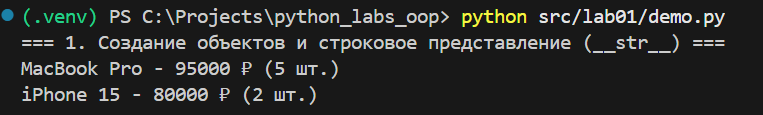
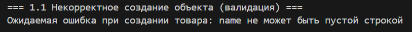
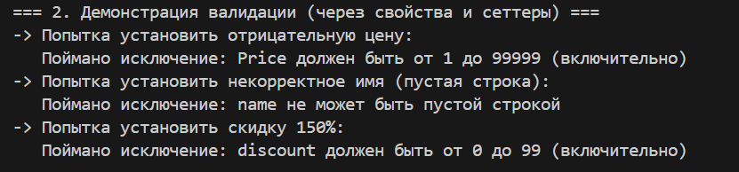
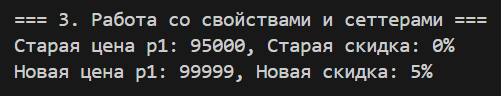
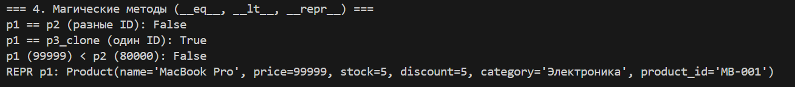
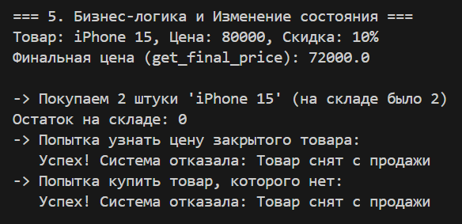
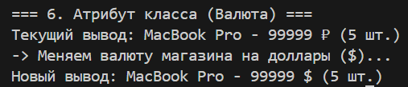

# Лабораторная работа 1 - Класс Product

**Вариант:** 3 (Интернет-магазин)

## Реализованный класс

### Атрибуты экземпляра (закрытые поля)
- `_name` - название товара
- `_price` - цена товара
- `_stock` - количество на складе
- `_discount` - скидка в процентах
- `_category` - категория товара
- `_product_id` - идентификатор товара (read-only)
- `_active` - логическое состояние товара (активен/неактивен)

### Атрибут класса
- `currency` - валюта магазина (по умолчанию "₽")

### Свойства (properties)
Реализованы свойства с валидацией через `@property` и `@setter`:
- `name` - с валидацией типа и проверкой на пустую строку
- `price` - с валидацией типа (int/float) и диапазона (1-99999)
- `stock` - с валидацией типа (int) и проверкой (>= 0)
- `discount` - с валидацией типа (int) и диапазона (0-99), включает `@deleter`
- `category` - с валидацией типа и проверкой на пустую строку
- `product_id` - только чтение (read-only property)

### Валидация данных (Модуль validate.py)
Логика проверок вынесена из класса в отдельный модуль (согласно принципу DRY). Реализованы следующие функции:
- `validate_name(value)` - проверка типа str и непустой строки
- `validate_price(value)` - проверка типа (int/float) и диапазона
- `validate_stock(value)` - проверка типа int и неотрицательности
- `validate_discount(value)` - проверка типа int и диапазона 0-99
- `validate_category(value)` - проверка типа str и непустой строки
- `validate_product_id(value)` - проверка типа str и непустой строки

### Магические методы
- `__str__()` - строковое представление товара
- `__repr__()` - техническое представление для отладки
- `__eq__(other)` - сравнение товаров по `product_id`
- `__lt__(other)` - сравнение товаров по цене

### Бизнес-методы
- `get_final_price()` - возвращает цену с учетом скидки (проверяет активность товара)
- `reduce_stock(quantity)` - уменьшает количество товара на складе (проверяет активность и достаточность)
- `update_available()` - автоматически обновляет состояние товара в зависимости от количества на складе
- `activate()` - активирует товар (выставляет на продажу)
- `deactivate()` - деактивирует товар (снимает с продажи)

### Логическое состояние объекта
Объект имеет состояние `_active`, которое влияет на поведение:
- `get_final_price()` работает только для активных товаров
- `reduce_stock()` блокирует операции для неактивных товаров
- `update_available()` автоматически меняет состояние при изменении количества

---

## Демонстрация работы (demo.py)

### 1. Создание объектов и строковое представление (__str__)
**Реализовано:** Создание двух объектов товаров и вывод через `print()` (использует `__str__`)

**Вывод терминала:** 

### 1.1. Некорректное создание объекта (валидация)
**Реализовано:** Попытка создать объект с некорректными данными (пустое имя, отрицательная цена, отрицательный stock, скидка > 99, пустые category и product_id)

**Вывод терминала:** 

### 2. Демонстрация валидации (через свойства и сеттеры)
**Реализовано:** Демонстрация работы валидации при попытке установить некорректные значения через сеттеры

**Вывод терминала:** 

### 3. Работа со свойствами и сеттерами
**Реализовано:** Успешное изменение свойств через сеттеры с валидацией

**Вывод терминала:** 

### 4. Магические методы (__eq__, __lt__, __repr__)
**Реализовано:** 
- Сравнение объектов через `__eq__` (по product_id)
- Сравнение через `__lt__` (по цене)
- Техническое представление через `__repr__`

**Вывод терминала:** 

### 5. Бизнес-логика и изменение состояния
**Реализовано:** 
- Получение финальной цены с учетом скидки
- Уменьшение количества товара на складе
- Автоматическое изменение состояния при обнулении количества
- Блокировка операций для неактивных товаров

**Вывод терминала:** 

### 6. Атрибут класса (Валюта)
**Реализовано:** Демонстрация изменения атрибута класса `currency`, который влияет на все экземпляры

**Вывод терминала:** 

