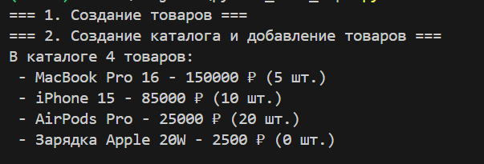
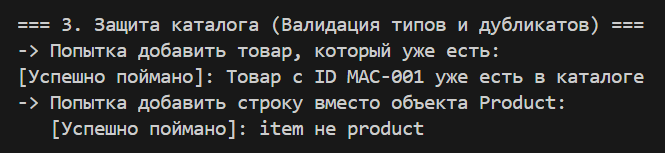
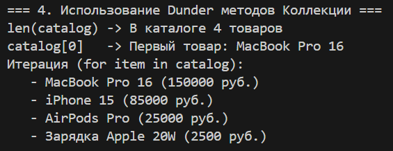
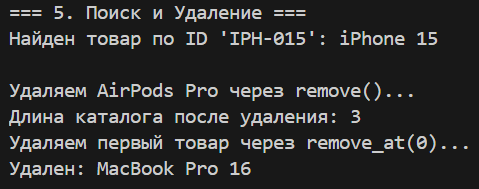
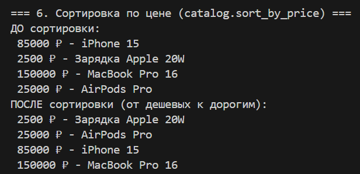
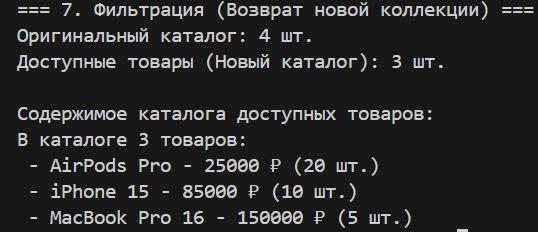

# Лабораторная работа №2 — Коллекции объектов

**Вариант:** 3 (Интернет-магазин)

---

### Реализованный класс: `ProductCatalog`

#### Dunder методы

- `__len__` — возвращает количество товаров в каталоге.
- `__iter__` — позволяет обходить каталог в цикле `for`.
- `__getitem__` — обеспечивает доступ к товарам по индексу (`catalog[i]`).
- `__str__` — формирует наглядный отчет о составе каталога.
- `__repr__` — техническое представление для отладки (с рекурсивным выводом `repr` вложенных объектов).

#### Методы
1. **Управление данными:**
   - `add(item)` — добавление товара с проверкой типа (`isinstance`) и контролем уникальности (запрет дубликатов по `product_id`).
   - `remove(item)` — удаление конкретного объекта.
   - `remove_at(index)` — удаление товара по его позиции с контролем границ списка.
   - `get_all()` — возвращает **копию** списка товаров (защитное копирование), предотвращая несанкционированное изменение внутреннего состояния.
   
2. **Поиск и аналитика:**
   - `find_by_id(item_id)` — поиск товара по уникальному строковому идентификатору.
   - `sort_by_price()` — сортировка содержимого каталога. Использует инвариант сравнения (`__lt__`), заложенный в классе `Product`.

3. **Фильтрация:**
   - `get_available()` — анализирует состояние и остатки товаров. Метод **не мутирует** текущий каталог, а возвращает **новый независимый экземпляр** `ProductCatalog`, содержащий только активные позиции.

---

## Демонстрация работы (demo.py)

### 1. Создание каталога и наполнение данными
Демонстрация базового создания объектов и вывода общего списка товаров через перегруженный метод строкового представления.

### 2. Защита целостности данных (Валидация)
Попытка нарушить правила каталога: добавление дубликата товара (с тем же ID) и попытка вставить объект некорректного типа (строку). Система блокирует операции и выбрасывает соответствующие исключения.

### 3. Работа с протоколами коллекций
Демонстрация вызова стандартных функций Python (`len`), обращения по индексу и итерации через цикл `for`.

### 4. Поиск и удаление элементов
Успешное нахождение товара по артикулу и демонстрация двух способов удаления: по ссылке на объект и по индексу в списке.

### 5. Сортировка по бизнес-метрикам
Сравнение состояния каталога до и после вызова метода сортировки по цене.

### 6. Фильтрация и создание новой коллекции
Ключевой сценарий: создание выборки только доступных товаров. Показано, что оригинальный каталог остается неизменным, а фильтрованный список является самостоятельным объектом класса `ProductCatalog`.

