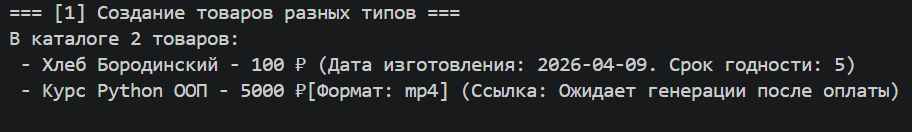
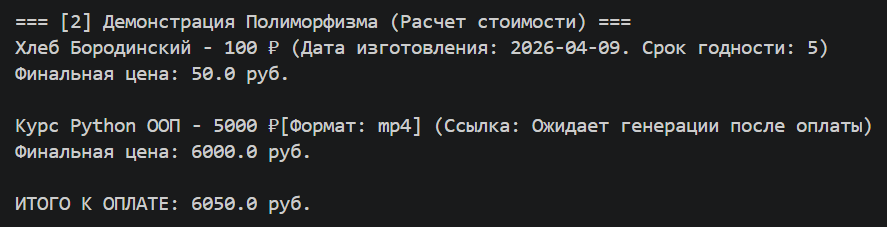
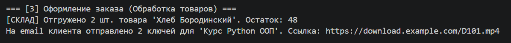
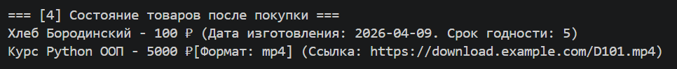
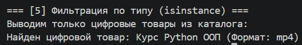

# Лабораторная работа №3

## 1. Цель работы

Изучение базовых концепций объектно-ориентированного проектирования: наследования и полиморфизма. Разработка иерархии классов на основе абстрактного базового класса (ABC), интеграция с ранее созданной коллекцией и реализация уникального поведения для дочерних классов при едином интерфейсе взаимодействия.

---

## 2. Описание реализованной иерархии классов

**Описание:**

*   **Базового класса:**
    Абстрактный класс `Product` описывает общую сущность продаваемого объекта. Он инкапсулирует общие атрибуты (название, базовая цена, скидка, категория, ID, статус активности). В нем реализован расчет базовой математики скидки (`get_final_price`), а также установлены строгие контракты в виде абстрактных методов `process()` и `calculate()`, которые обязывают дочерние классы реализовывать собственную логику обработки и ценообразования.

*   **Дочерних классов:**
    *   `FoodProduct` (Продукты питания) — физический товар с ограниченным сроком хранения.
    *   `DigitalProduct` (Цифровой товар) — нематериальный продукт в виде файла (книги, курсы).

*   **Различий между ними:**
    *   **Атрибуты:** У еды есть привязка к складу (`stock`) и датам производства. У цифрового товара — формат файла и ссылка.
    *   **Ценообразование (Полиморфизм `calculate`):** Еда получает автоматическую уценку 50%, если срок годности подходит к концу. Цифровой товар применяет множитель стоимости в зависимости от формата файла (напр. `mp4` дороже `zip`).
    *   **Обработка заказа (Полиморфизм `process`):** Для еды списывается количество со склада. Для цифрового товара — генерируется и «отправляется» ссылка на скачивание.

---

## 3. Демонстрация работы

Описание сценариев из `demo.py`:

*   **Сценарий 1: Работа с разными типами через одну коллекцию.** Создание объектов `FoodProduct` и `DigitalProduct`. Интеграция с классом-контейнером `ProductCatalog` (из ЛР-2). Добавление разнородных объектов в единую структуру хранения.

    

*   **Сценарий 2: Вызов одинакового метода — разное поведение.** Демонстрация полиморфизма при расчете стоимости. В едином цикле вызывается `get_final_price()`. Программа автоматически учитывает сроки годности для хлеба и наценку за формат для курса без явной проверки типов.

    

*   **Сценарий 3: Оформление заказа (Обработка товаров).** Полиморфный вызов метода `process()`. Система уменьшает физический остаток на складе для еды и имитирует генерацию доступа для цифрового продукта.

    

*   **Сценарий 4: Изменение состояния после покупки.** Проверка обновленного строкового представления объектов. У цифрового товара статус «Ожидает генерации» меняется на готовую ссылку.

    

*   **Сценарий 5: Проверка типов и фильтрация.** Использование функции `isinstance()` для поиска в общей коллекции объектов конкретного класса (вывод только цифровых товаров с их специфичными атрибутами, например, форматом).

    

---

## 4. Вывод

Что было изучено:

*   **Наследование:** механизм вынесения общих полей в родительский класс для соблюдения принципа DRY. Применение `super()` для расширения конструктора.
*   **Полиморфизм:** реализация единого интерфейса (`process`, `calculate`) для взаимодействия с массивом разнородных объектов. Продемонстрировано, что вызывающему коду не нужно знать конкретный подкласс для корректной работы бизнес-логики.
*   **Интеграция:** подтверждено, что коллекция, спроектированная с использованием базового класса, корректно работает со всеми его наследниками (принцип подстановки Лисков).
*   **Идентификация типов:** использование `isinstance()` для выполнения специфичных операций, доступных только конкретному дочернему классу.