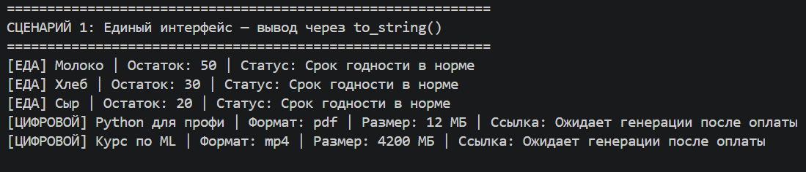
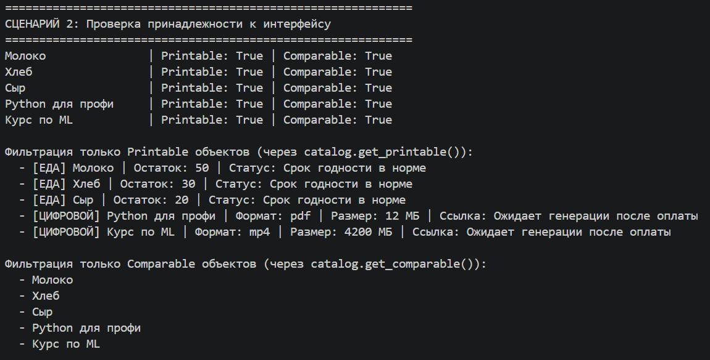
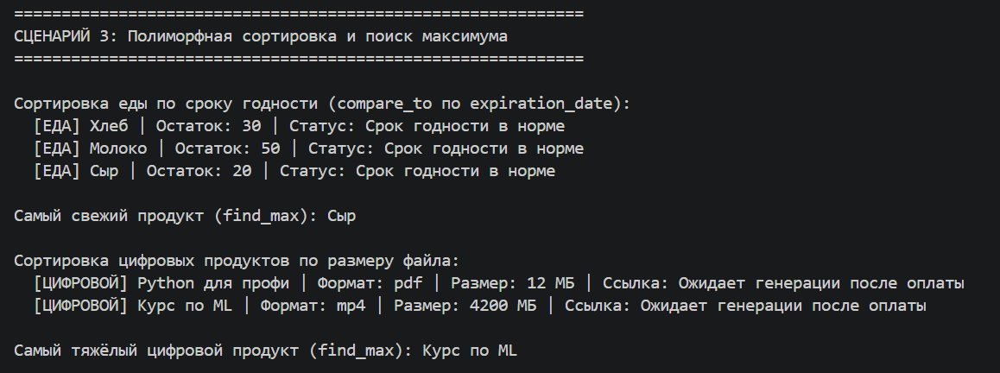
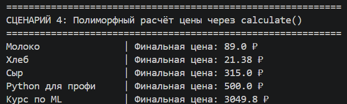

# Лабораторная работа 4 — Интерфейсы и абстрактные классы

## 1. Цель работы

Изучить применение интерфейсов и абстрактных классов в Python:

* определение контрактов поведения через абстрактные базовые классы (`ABC`)
* реализация интерфейсов в конкретных классах
* полиморфная работа с объектами через общий интерфейс

---

## 2. Описание интерфейсов

Интерфейсы определены в `interfaces.py` с использованием модуля `abc`.

| Интерфейс    | Метод                          | Назначение                                                             |
|--------------|--------------------------------|------------------------------------------------------------------------|
| `Printable`  | `to_string() -> str`           | Возвращает строковое представление объекта                             |
| `Comparable` | `compare_to(other) -> int`     | Сравнивает объект с другим: `1` — больше, `-1` — меньше, `0` — равны |

---

## 3. Реализация в классах

Оба класса наследуют `Product` (из lab03) и реализуют оба интерфейса.

### `FoodProduct` (`base.py`)

* `to_string()` — выводит название, остаток на складе и статус срока годности (`Просрочен` / `Срок годности в норме`)
* `compare_to(other)` — сравнивает по дате истечения срока годности (`production_date + shelf_life_days`)

### `DigitalProduct` (`base.py`)

* `to_string()` — выводит название, формат файла, размер в МБ и ссылку на скачивание
* `compare_to(other)` — сравнивает по размеру файла (`file_size`)

### Ключевое различие

Логика сравнения: `FoodProduct` сортируется по «свежести» (дате), `DigitalProduct` — по «весу» (МБ). Сортирующий код (`sort_items`, `find_max`) при этом одинаков для обоих типов — он работает только через `compare_to()`.

### `ProductCatalog` (`collection.py`)

Каталог предоставляет два метода фильтрации по интерфейсу:

* `get_printable()` — возвращает все объекты, реализующие `Printable`
* `get_comparable()` — возвращает все объекты, реализующие `Comparable`

---

## 4. Демонстрация

Все сценарии запускаются из `demo.py`.

### Сценарий 1 — Единый интерфейс вывода (`Printable`)

Функция `print_all()` принимает любые `Printable`-объекты и вызывает `to_string()` для каждого. Результат для `FoodProduct` и `DigitalProduct` форматируется по-разному, но вызывающий код одинаков.

---

### Сценарий 2 — Проверка принадлежности к интерфейсу (`isinstance`)

Для каждого товара выводится, реализует ли он `Printable` и `Comparable`. Затем каталог фильтруется через `get_printable()` и `get_comparable()`.

---

### Сценарий 3 — Полиморфная сортировка и поиск максимума (`Comparable`)

Функции `sort_items()` и `find_max()` используют только `compare_to()`:

* еда сортируется по сроку годности — самый свежий определяется через `find_max()`
* цифровые продукты сортируются по размеру файла — самый тяжёлый через `find_max()`

---

### Сценарий 4 — Полиморфный расчёт цены (`calculate`)

Для каждого товара вызывается `get_final_price()`. Логика расчёта различается:

* `FoodProduct` — применяет скидку 50 % если до истечения срока ≤ 3 дней; просроченный товар снимается с продажи
* `DigitalProduct` — умножает цену на коэффициент формата файла (`pdf` × 1.0, `mp4` × 1.2, `flac` × 1.5 и т. д.)

