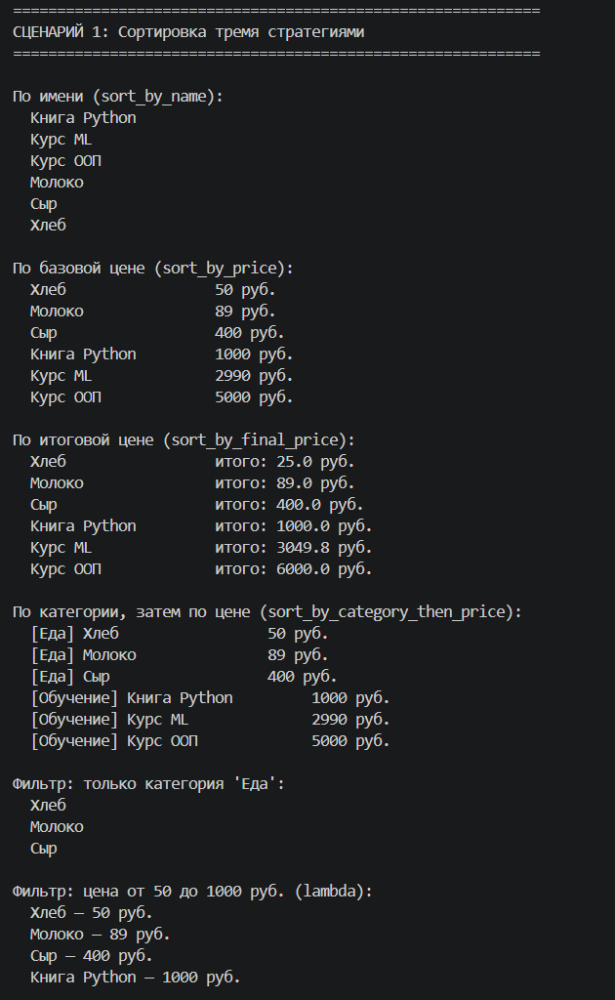
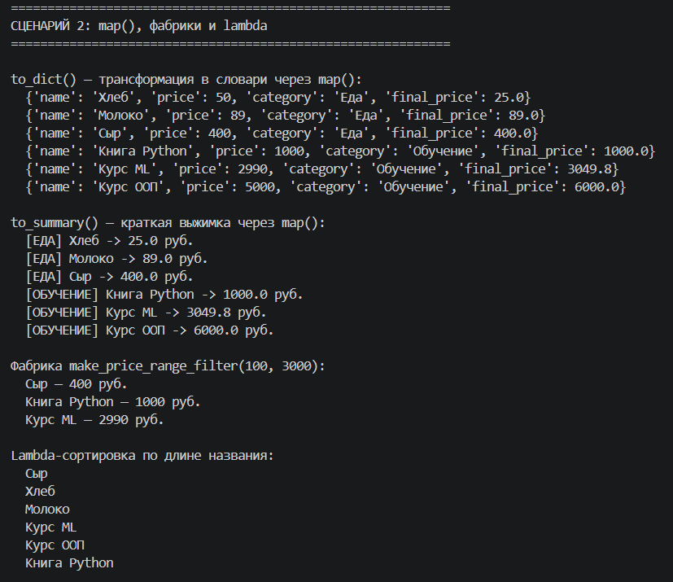
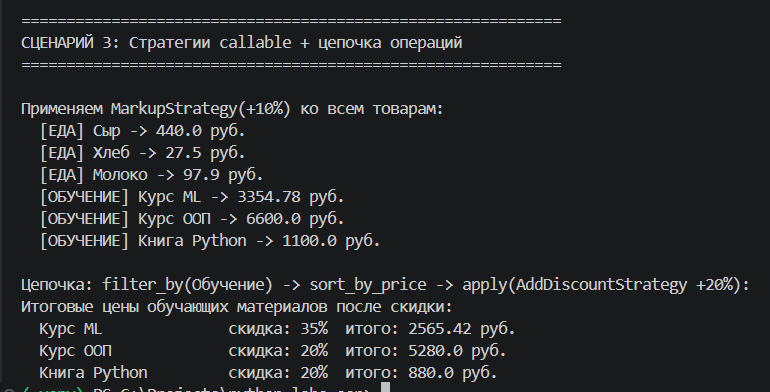

# Лабораторная работа 5 — Функции как аргументы. Стратегии и делегаты

## 1. Цель работы

Освоить передачу функций как аргументов, встроенные функции высшего порядка (`map`, `filter`, `sorted`), концепцию паттерна «Стратегия», `lambda`-выражения и интеграцию функционального стиля с ООП.

---

## 2. Реализованные функции и стратегии

### Функции-стратегии сортировки

Key-функции для передачи в `sort_by()` и `sorted()`:

* `sort_by_name` — сортировка по имени товара (алфавитный порядок)
* `sort_by_price` — по базовой цене по возрастанию
* `sort_by_final_price` — по итоговой цене с учётом скидки
* `sort_by_category_then_price` — сначала по категории, затем по цене внутри неё

### Функции-трансформации (для `map`)

* `to_dict(item)` — преобразует товар в словарь (`name`, `price`, `category`, `final_price`)
* `to_summary(item)` — возвращает краткую строку вида `[КАТЕГОРИЯ] Название -> цена руб.`

### Фабрики функций (функции высшего порядка)

Фабрики используют замыкания — возвращают предикат с захваченными параметрами:

* `make_category_filter(category)` — создаёт предикат, проверяющий категорию товара
* `make_price_range_filter(min_price, max_price)` — создаёт предикат для фильтрации по диапазону цен

### Паттерн «Стратегия» — callable-объекты

Классы реализуют `__call__`, что позволяет передавать их как обычные функции:

* `AddDiscountStrategy(percent)` — увеличивает скидку товара на `percent`% (не выше 100%)
* `MarkupStrategy(percent)` — повышает базовую цену товара на `percent`%

Пример: объект `AddDiscountStrategy(20)` передаётся в `catalog.apply()` точно так же, как обычная функция — `apply` не знает, функция это или объект с `__call__`.

---

## 3. Демонстрация работы

### Сценарий 1 — Сортировка стратегиями и фильтрация

Каталог из 6 товаров сортируется четырьмя стратегиями: по имени, по базовой цене, по итоговой цене и по категории+цене. Фильтрация: по категории через фабрику `make_category_filter`, по диапазону цен через `lambda`.



---

### Сценарий 2 — `map()`, фабрики, `lambda`

`to_dict()` и `to_summary()` применяются через `catalog.map()` — весь каталог трансформируется без явного цикла. Фабрика `make_price_range_filter(100, 3000)` создаёт предикат с параметрами. `lambda` используется для сортировки по длине названия прямо в вызове.



---

### Сценарий 3 — Callable-стратегии и цепочка операций

`MarkupStrategy(+10%)` передаётся в `catalog.apply()` как объект-стратегия. Затем строится цепочка операций:

```python
catalog
    .filter_by(make_category_filter("Обучение"))
    .sort_by(sort_by_price)
    .apply(AddDiscountStrategy(20))
```

`filter_by()` возвращает новый каталог, `sort_by()` и `apply()` возвращают `self` — это позволяет выстраивать цепочку без промежуточных переменных.



---

## 4. Вывод

В ходе работы изучено:

* **Передача функций как аргументов** — функция передаётся по ссылке, без вызова; принимающий код вызывает её сам
* **`lambda`, `map`, `filter`** — компактные инструменты для трансформации и фильтрации коллекций без явных циклов
* **Функции высшего порядка и замыкания** — фабрики возвращают функции, захватывающие параметры из внешнего контекста
* **Паттерн «Стратегия»** — поведение инкапсулируется в callable-объект и подменяется без изменения вызывающего кода
